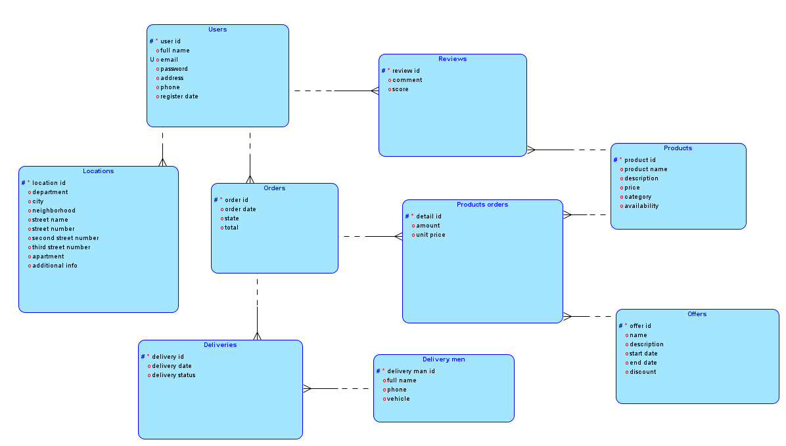
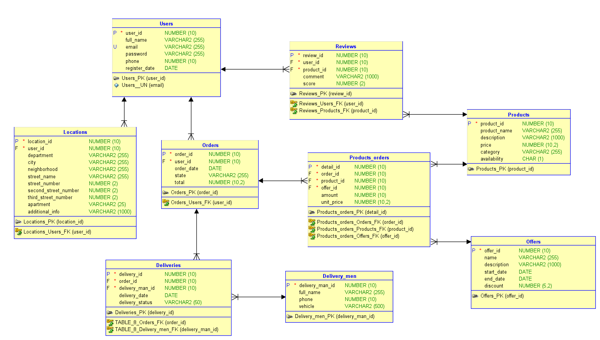
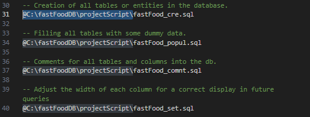
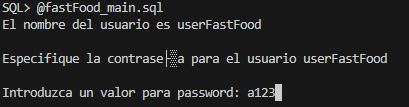
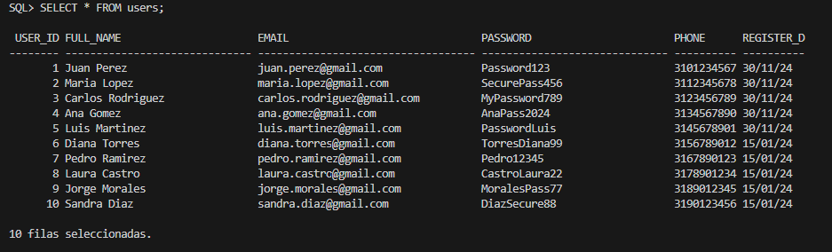

# Project SQL - Fast Food Database

### Base de Datos para aplicación de pedidos a domicilio

Este repositorio contiene el esquema de una base de datos diseñada para gestionar los pedidos a domicilio de un restaurante que se hagan mediante una app. La base de datos está estructurada para almacenar información sobre clientes, productos, pedidos, entregas, ofertas y reseñas.

## Estructura de la Base de Datos

La base de datos está compuesta por las siguientes entidades y sus relaciones:

- Usuarios (users): Almacena información de los usuarios registrados en la aplicación.
- Ubicaciones (locations): Guarda las direcciones de entrega de los clientes o usuarios.
- Productos (products): Contiene los productos disponibles en el menú.
- Pedidos (orders): Registra los pedidos realizados por los clientes o usuarios.
- Detalles de Pedidos (order_products): Detalla los productos incluidos en cada pedido.
- Repartidores (delivery_men): Almacena información de los repartidores.
- Entregas (deliveries): Registra las entregas realizadas.
- Ofertas (offers): Contiene información sobre las promociones y descuentos.
- Reseñas (reviews): Almacena las reseñas de los clientes sobre los productos.

## Modelo lógico

La siguiente imágen muestra el esquema de la base de datos anteriormente descrito.



## Modelo físico

La siguiente imagen expone el modelo físico que describe a mayor detalle el esquema de la base de datos.



## Requisitos Previos

- Oracle Database: Asegúrate de tener instalado Oracle Database en tu sistema.

## Instalación

1. Clonar el repositorio:

   ```Bash
   git clone https://tu-repositorio.git
   ```

   También se puede descargar esta carpeta sino se desea clonar el repositorio.

2. Modificar las rutas que hay dentro del archivo [fastFood_main.sql](www.bit.ly/1EqAdIp):

   Despues de clonar el repositorio o descargar esta carpeta, debera ubicarse dentro y buscar el archivo [fastFood_main.sql](www.bit.ly/1EqAdIp) y modificar las rutas de los demás scripts para que el sistema pueda encontrar los scripts y ejecutarlos correctamente.

   

3. Conectarse a la base de datos:

   Abrir la terminal cómo administrador dentro de la carpeta donde esten los scripts y luego ingresar el siguiente comando.

   ```SQL
   sqlplus sys/oracle@localhost:1521/xepdb1 as sysdba
   ```

   _Tenga en cuenta que la palabra oracle debe ser cambiada por la contraseña que tenga definida para sus sistema oracle database._

4. Ejecutar el script [fastFood_main.sql](www.bit.ly/1EqAdIp):

   Una vez ya se halla conectado a oracle database puede ejecutar el script que hace la magia, solamente tendra que ingresar el siguiente comando para que esto suceda.

   ```SQL
   @fastFood_main.sql
   ```

   Después se le pedirá que asigne una contraseña para el usuario que se está creando que es `userFastFood`, se debe ver de esta forma:

   

   _En el ejemplo se asigna cómo contraseña `a123` pero usted puede asignar la que desee_

5. Verificar que todo halla ido bien:

   Por último, verifique que los scripts se ejecutaron correctamente, para esto tendrá que ejecutar la siguiente sentencia dentro de la terminal:

   ```SQL
   SELECT * FROM users;
   ```

   El resultado de esta consulta deberá ser el siguiente:
   

## Badgets

 
